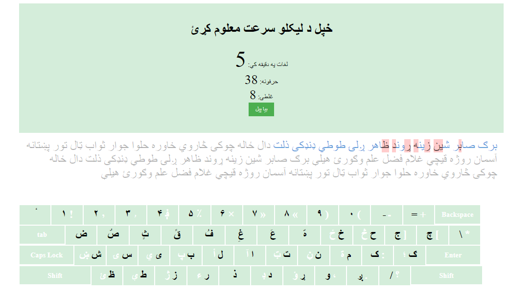
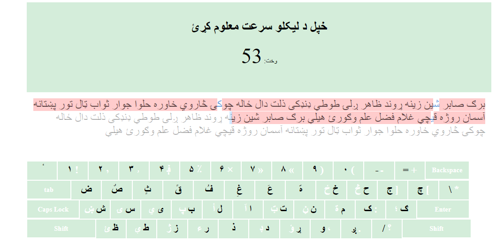

# Pashto-Typing
test your Pashto typing speed, you will also learn how to type with Pashto keyboard.
imporve your typing skill, check your speed and imporve it.
## (Note that you should change your keyboard language into Pashto)


## Features
- how many words per minute you can type in Pashto language?
- check you typing speed in Pashto language.
- imporve your Pashto typing speed.
- learn how to type in Pashto.


- Get the code:
    ```
    git clone https://github.com/Fazlullahmamond/Pashto-Typing.git
    ```


check demo [https://raw.githack.com/fazlullahmamond/Pashto-Typing/main/pashtoTyping.html]


## License
Copyright (c) Mamond. All rights reserved.
